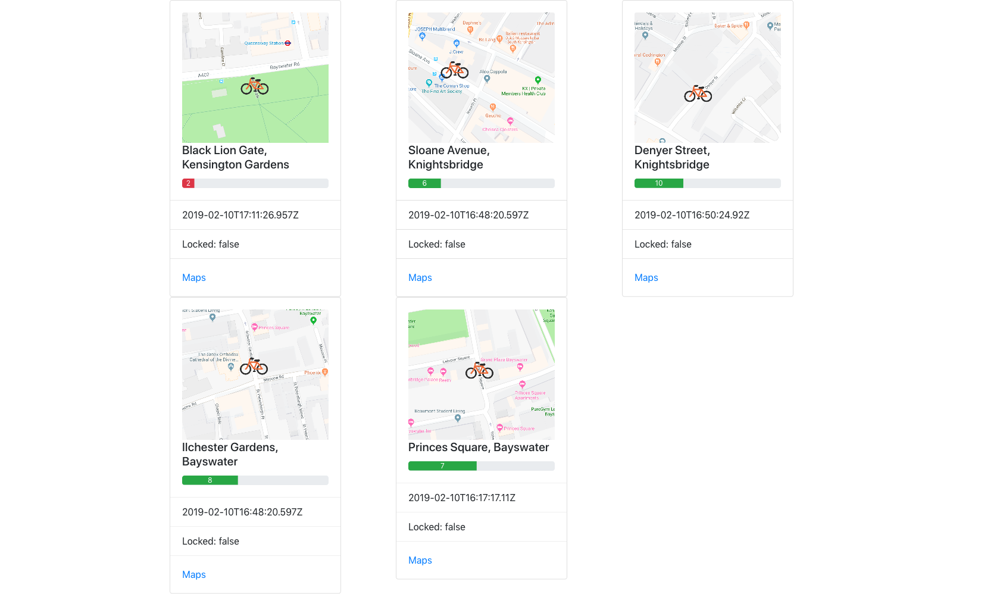

# TFL Bikes 🚲

A small frontend to show TFL Bikes availability around various location of interest.


---





---

## How it works

No backend needed. It's 200 lines of Javascript, querying [TFL's public API](https://api.tfl.gov.uk/swagger/ui/index.html?url=/swagger/docs/v1#!/BikePoint/BikePoint_GetAll) and interpreting the results.

## Configuration

#### 1. Set list of Bike Points in `tfl.js`

```js
const terminals = [
  "BikePoints_307",
  "BikePoints_584",
  "BikePoints_261",
  "BikePoints_163",
  "BikePoints_209"
]
```

#### 2. Add thumbnail images in `img/`

```
img/BikePoints_307.png
img/BikePoints_584.png
img/BikePoints_261.png
img/BikePoints_163.png
img/BikePoints_209.png
```

I made the current ones using Google Maps screenshots and added a bike logo where the Bike Point was. Very manual for now, will try to find an automated solution later.

---

And that's pretty much it 😊
